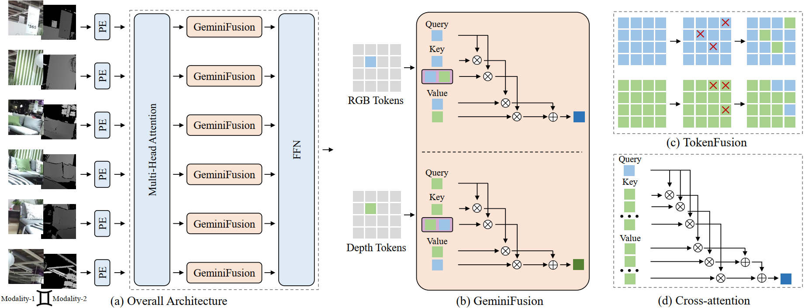

<div align="center"> 

##  GeminiFusion for Multimodal 3D Object Detection on KITTI Dataset (ICML 2024)

</div>

<p align="center">

<a href="https://arxiv.org/pdf/2406.01210">
    </a>
<a href="https://pytorch.org/">
    </a>
<a href="LICENSE">
    </a>

</p>

	
	
[](https://paperswithcode.com/sota/semantic-segmentation-on-deliver-1?p=geminifusion-efficient-pixel-wise-multimodal)
[](https://paperswithcode.com/sota/semantic-segmentation-on-nyu-depth-v2?p=geminifusion-efficient-pixel-wise-multimodal)
[](https://paperswithcode.com/sota/semantic-segmentation-on-sun-rgbd?p=geminifusion-efficient-pixel-wise-multimodal)

This is the official implementation of our paper "[GeminiFusion: Efficient Pixel-wise Multimodal Fusion for Vision Transformer](https://arxiv.org/pdf/2406.01210)".

Authors: Ding Jia, Jianyuan Guo, Kai Han, Han Wu, Chao Zhang, Chang Xu, Xinghao Chen


## Code List

We have applied our GeminiFusion to different tasks and datasets:

* GeminiFusion for Multimodal Semantic Segmentation
  * [NYUDv2 & SUN RGBD datasets](https://github.com/JiaDingCN/GeminiFusion/tree/main)
  * [DeLiVER dataset](https://github.com/JiaDingCN/GeminiFusion/tree/DeLiVER)
* GeminiFusion for Multimodal 3D Object Detection
  * (This branch)[KITTI dataset](https://github.com/JiaDingCN/GeminiFusion/tree/3d_object_detection_kitti)

## Introduction

We propose GeminiFusion, a pixel-wise fusion approach that capitalizes on aligned cross-modal representations. GeminiFusion elegantly combines intra-modal and inter-modal attentions, dynamically integrating complementary information across modalities. We employ a layer-adaptive noise to adaptively control their interplay on a per-layer basis, thereby achieving a harmonized fusion process. Notably, GeminiFusion maintains linear complexity with respect to the number of input tokens, ensuring this multimodal framework operates with efficiency comparable to unimodal networks. Comprehensive evaluations demonstrate the superior performance of our GeminiFusion against leading-edge techniques.


## Framework



## Model Zoo

We used the results of the last epoch for all experiments.(The numbers are from the ckpt). **Models are evaluated on the KITTI validation set for vehicle detection, under the evaluation metric of 3D Average Precision (AP)**                                              

### 3D AP R11(IoU=0.7) 

| Model |Param| Easy | Moderate | Hard | Download |
|:-------:|:--------:|:--------:|:-------:|:-------------------:|:--------:|
| MVX-Net(Offical) | 33.8M|87.49| 77.04| 74.54 | [model](https://download.openmmlab.com/mmdetection3d/v1.1.0_models/mvxnet/mvxnet_fpn_dv_second_secfpn_8xb2-80e_kitti-3d-3class/mvxnet_fpn_dv_second_secfpn_8xb2-80e_kitti-3d-3class-8963258a.pth) &#124; [log](https://download.openmmlab.com/mmdetection3d/v1.1.0_models/mvxnet/mvxnet_fpn_dv_second_secfpn_8xb2-80e_kitti-3d-3class/mvxnet_fpn_dv_second_secfpn_8xb2-80e_kitti-3d-3class-20230424_132228.log) &#124; [config](configs/mvxnet/mvxnet_fpn_dv_second_secfpn_8xb2-80e_kitti-3d-3class.py) |
| MVX-Net + GeminiFusion |34.8M|  88.49| 77.36| 74.61 | [model](https://github.com/JiaDingCN/GeminiFusion/releases/download/CheckPoint_and_Log/geminifusion_mvxnet.pth) &#124; [log](https://github.com/JiaDingCN/GeminiFusion/releases/download/CheckPoint_and_Log/geminifusion_mvxnet_training.log) &#124; [config](configs/geminifusion_mvxnet/geminifusion_mvxnet_fpn_dv_second_secfpn_8xb2-80e_kitti-3d-3class.py) |

### 3D AP R40(IoU=0.7) 

| Model | Param|Easy | Moderate | Hard | Download |
|:-------:|:--------:|:--------:|:-------:|:-------------------:|:--------:|
| MVX-Net(Offical) |33.8M| 88.41| 78.77| 74.27  | [model](https://download.openmmlab.com/mmdetection3d/v1.1.0_models/mvxnet/mvxnet_fpn_dv_second_secfpn_8xb2-80e_kitti-3d-3class/mvxnet_fpn_dv_second_secfpn_8xb2-80e_kitti-3d-3class-8963258a.pth) &#124; [log](https://download.openmmlab.com/mmdetection3d/v1.1.0_models/mvxnet/mvxnet_fpn_dv_second_secfpn_8xb2-80e_kitti-3d-3class/mvxnet_fpn_dv_second_secfpn_8xb2-80e_kitti-3d-3class-20230424_132228.log) &#124; [config](configs/mvxnet/mvxnet_fpn_dv_second_secfpn_8xb2-80e_kitti-3d-3class.py) |
| MVX-Net + GeminiFusion | 34.8M| 89.43| 78.76| 74.46  | [model](https://github.com/JiaDingCN/GeminiFusion/releases/download/CheckPoint_and_Log/geminifusion_mvxnet.pth) &#124; [log](https://github.com/JiaDingCN/GeminiFusion/releases/download/CheckPoint_and_Log/geminifusion_mvxnet_training.log) &#124; [config](configs/geminifusion_mvxnet/geminifusion_mvxnet_fpn_dv_second_secfpn_8xb2-80e_kitti-3d-3class.py) |

## Installation

We build our GeminiFusion on the MMDetection3D codebase. Therefore, the installation is exactly the same as the MMDetection3D. Please refer to [the offical MMDetection3D install instructions](https://mmdetection3d.readthedocs.io/en/latest/get_started.html). Also, you may refer to [the offical MMDetection3D readme](./README_mmdet3d.md) if any problem about the MMDetection3D framework.

Most of the `GeminiFusion`-related code locate in the following files: 
* [config/geminifusion_mvxnet](configs/geminifusion_mvxnet/geminifusion_mvxnet_fpn_dv_second_secfpn_8xb2-80e_kitti-3d-3class.py)
* [fusion_layers/point_fusion.py](mmdet3d/models/layers/fusion_layers/point_fusion.py)
* [voxel_encoders/voxel_encoder.py](mmdet3d/models/voxel_encoders/voxel_encoder.py)

## Data

**KITTI Dataset Prapare**

Please follow [the MMDetection3D data preparation instructions for KITTI](https://mmdetection3d.readthedocs.io/en/v1.1.0/user_guides/dataset_prepare.html#kitti).

## Train

We use 4 GPUs to train the GeminiFusion_MVX-Net.
```shell
bash ./tools/dist_train.sh configs/geminifusion_mvxnet/geminifusion_mvxnet_fpn_dv_second_secfpn_8xb2-80e_kitti-3d-3class.py 4
```

## Test

Download the trained checkpoint through our link and test.
```shell
bash ./tools/dist_test.sh configs/geminifusion_mvxnet/geminifusion_mvxnet_fpn_dv_second_secfpn_8xb2-80e_kitti-3d-3class.py geminifusion_mvxnet.pth 4 
```

Test after your training finished.
```shell
bash ./tools/dist_test.sh configs/geminifusion_mvxnet/geminifusion_mvxnet_fpn_dv_second_secfpn_8xb2-80e_kitti-3d-3class.py work_dirs/geminifusion_mvxnet_fpn_dv_second_secfpn_8xb2-80e_kitti-3d-3class/epoch_40.pth 4 
```

You can also get the number of params by the command below:
```Shell
# param, geminifusion_mvxnet
python ./tools/analysis_tools/get_flops.py configs/geminifusion_mvxnet/geminifusion_mvxnet_fpn_dv_second_secfpn_8xb2-80e_kitti-3d-3class.py

# param, mvxnet
python ./tools/analysis_tools/get_flops.py configs/mvxnet/mvxnet_fpn_dv_second_secfpn_8xb2-80e_kitti-3d-3class.py
```


## Citation

If you find this work useful for your research, please cite our paper:

```
@misc{jia2024geminifusion,
      title={GeminiFusion: Efficient Pixel-wise Multimodal Fusion for Vision Transformer}, 
      author={Ding Jia and Jianyuan Guo and Kai Han and Han Wu and Chao Zhang and Chang Xu and Xinghao Chen},
      year={2024},
      eprint={2406.01210},
      archivePrefix={arXiv},
      primaryClass={cs.CV}
}
```

## Acknowledgement
Part of our code is based on the open-source project [MMDetection3D](https://github.com/open-mmlab/mmdetection3d).
