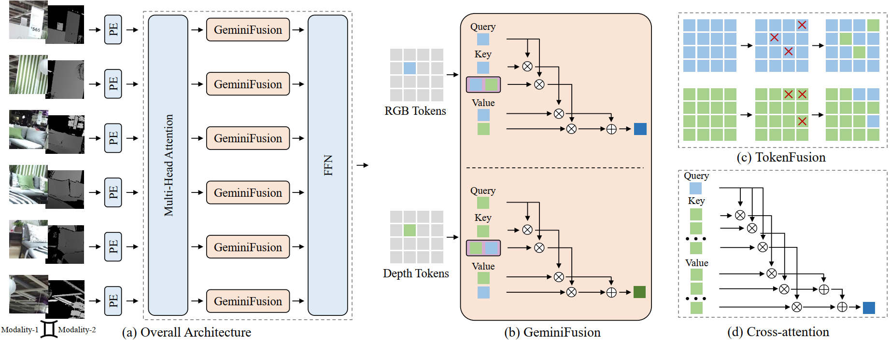

<div align="center"> 

##  GeminiFusion for Multimodal Segementation on DeLiVER Dataset (ICML 2024)

</div>

<p align="center">

<a href="https://arxiv.org/pdf/2406.01210">
    </a>
<a href="https://pytorch.org/">
    </a>
<a href="LICENSE">
    </a>

</p>

	
	
[](https://paperswithcode.com/sota/semantic-segmentation-on-deliver-1?p=geminifusion-efficient-pixel-wise-multimodal)
[](https://paperswithcode.com/sota/semantic-segmentation-on-nyu-depth-v2?p=geminifusion-efficient-pixel-wise-multimodal)
[](https://paperswithcode.com/sota/semantic-segmentation-on-sun-rgbd?p=geminifusion-efficient-pixel-wise-multimodal)

This is the official implementation of our paper "[GeminiFusion: Efficient Pixel-wise Multimodal Fusion for Vision Transformer](https://arxiv.org/pdf/2406.01210)".

Authors: Ding Jia, Jianyuan Guo, Kai Han, Han Wu, Chao Zhang, Chang Xu, Xinghao Chen


## Code List

We have applied our GeminiFusion to different tasks and datasets:

* GeminiFusion for Multimodal Semantic Segmentation
  * [NYUDv2 & SUN RGBD datasets](https://github.com/JiaDingCN/GeminiFusion/tree/main)
  * (This branch)[DeLiVER dataset](https://github.com/JiaDingCN/GeminiFusion/tree/DeLiVER)
* GeminiFusion for Multimodal 3D Object Detection
  * [KITTI dataset](https://github.com/JiaDingCN/GeminiFusion/tree/3d_object_detection_kitti)

## Introduction

We propose GeminiFusion, a pixel-wise fusion approach that capitalizes on aligned cross-modal representations. GeminiFusion elegantly combines intra-modal and inter-modal attentions, dynamically integrating complementary information across modalities. We employ a layer-adaptive noise to adaptively control their interplay on a per-layer basis, thereby achieving a harmonized fusion process. Notably, GeminiFusion maintains linear complexity with respect to the number of input tokens, ensuring this multimodal framework operates with efficiency comparable to unimodal networks. Comprehensive evaluations demonstrate the superior performance of our GeminiFusion against leading-edge techniques.


## Framework


## Model Zoo                                           

| Model | backbone|Modals| mIoU | Download |
|:-------:|:--------:|:--------:|:-------:|:-------------------:|
| GeminiFusion | MiT-B2|RGB+Depth| 66.4 |  [model](https://github.com/JiaDingCN/GeminiFusion/releases/download/DeLiVER/geminifusion_b2_deliver_rgbd.pth) &#124; [config](configs/deliver_rgbd_8cards_2e-4.yaml) |
| GeminiFusion | MiT-B2|RGB+Event| 58.5 |  [model]() &#124; [config](configs/deliver_rgbe_8cards_2e-4.yaml) |
| GeminiFusion | MiT-B2|RGB+LiDAR| 58.6 |  [model]() &#124; [config](configs/deliver_rgbl_8cards_2e-4.yaml) |
| GeminiFusion | MiT-B2|RGB+Depth+Event+LiDAR| 66.9 |  [model](https://github.com/JiaDingCN/GeminiFusion/releases/download/DeLiVER/geminifusion_b2_deliver_rgbdel.pth) &#124; [config](configs/deliver_rgbdel_8cards_2e-4.yaml) |

## Installation

We build our GeminiFusion on the CMNeXt codebase, which requires no additional installation steps. If any problem about the framework, you may refer to [the offical CMNeXt readme](./README-DELIVER.md).

Most of the `GeminiFusion`-related code locate in the following files: 
* [configs](configs)
* [models/geminifusion.py](semseg/models/geminifusion.py)
* [models/backbones/geminifusion_backbone.py](semseg/models/backbones/geminifusion_backbone.py)

## Data

**DeLiVER Dataset Prapare**

Please follow [the offical data preparation instructions for DeLiVER](./README-DELIVER.md#data-folder-structure).

## Train

We use 8 GPUs to train the GeminiFusion.
```shell
export PYTHONPATH="path/to/here"

# b2,rgb+d  
python -m torch.distributed.launch --master_port 2255 --nproc_per_node=8 --use_env tools/train_mm.py --cfg configs/deliver_rgbd_8cards_2e-4.yaml \
--drop_path_rate 0.4

# b2,rgb+e  
python -m torch.distributed.launch --master_port 2245 --nproc_per_node=8 --use_env tools/train_mm.py --cfg configs/deliver_rgbe_8cards_2e-4.yaml \
--drop_path_rate 0.4

# b2,rgb+l  
python -m torch.distributed.launch --master_port 2235 --nproc_per_node=8 --use_env tools/train_mm.py --cfg configs/deliver_rgbl_8cards_2e-4.yaml \
--drop_path_rate 0.4

# b2,rgb+d+e+l  
python -m torch.distributed.launch --master_port 2225 --nproc_per_node=8 --use_env tools/train_mm.py --cfg configs/deliver_rgbdel_8cards_2e-4.yaml \
--drop_path_rate 0.2
```

## Test

To evaluate the downloaded checkpoint, you may change the TEST:MODEL_PATH on the config.

```shell
export PYTHONPATH="path/to/here"

# b2,rgb+d  
CUDA_VISIBLE_DEVICES=0 python tools/val_mm.py --cfg configs/deliver_rgbd_8cards_2e-4.yaml 

# b2,rgb+e  
CUDA_VISIBLE_DEVICES=0 python tools/val_mm.py --cfg configs/deliver_rgbe_8cards_2e-4.yaml 

# b2,rgb+l  
CUDA_VISIBLE_DEVICES=0 python tools/val_mm.py --cfg configs/deliver_rgbl_8cards_2e-4.yaml 

# b2,rgb+d+e+l  
CUDA_VISIBLE_DEVICES=0 python tools/val_mm.py --cfg configs/deliver_rgbdel_8cards_2e-4.yaml 
```


## Citation

If you find this work useful for your research, please cite our paper:

```
@misc{jia2024geminifusion,
      title={GeminiFusion: Efficient Pixel-wise Multimodal Fusion for Vision Transformer}, 
      author={Ding Jia and Jianyuan Guo and Kai Han and Han Wu and Chao Zhang and Chang Xu and Xinghao Chen},
      year={2024},
      eprint={2406.01210},
      archivePrefix={arXiv},
      primaryClass={cs.CV}
}
```


## Acknowledgement
Part of our code is based on the open-source project [CMNeXt](https://github.com/jamycheung/DELIVER).
